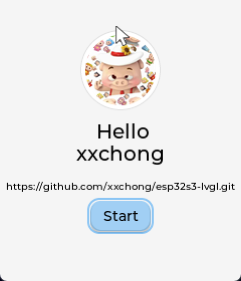
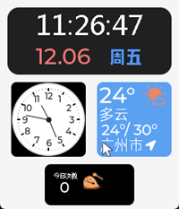
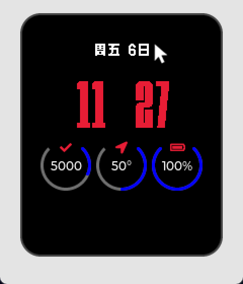
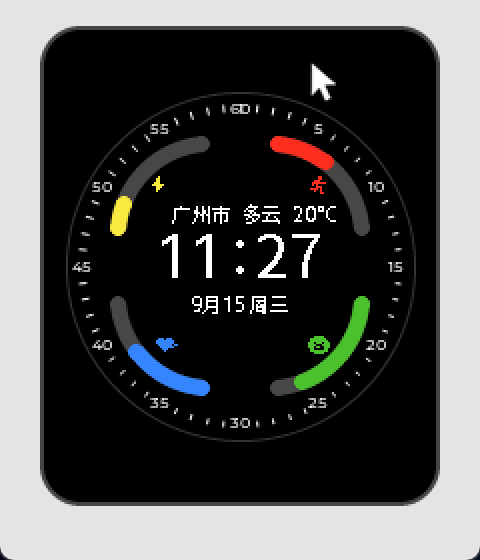
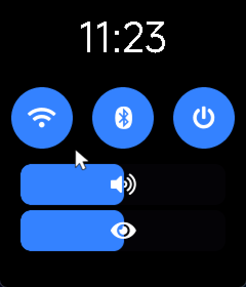
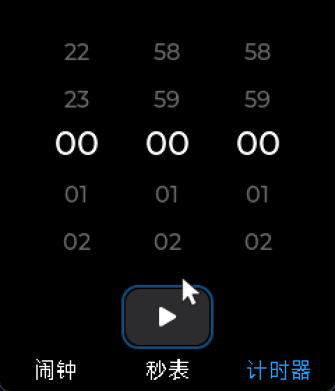
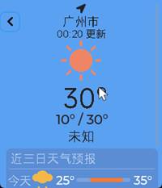
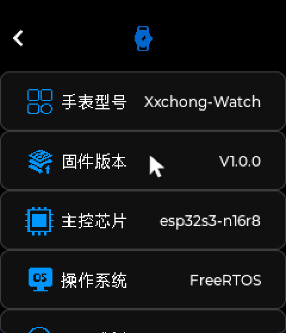

# XCHONG的LVGL项目

## 项目目标：
完成一个界面精美的手表
    
## 目前进度：
1. 完成整体框架的搭建，手势识别、屏幕显示、按键输入、屏幕切换、内存管理
2. 完成了设置app、时钟app、音乐app、天气app等等的初步UI开发,待后端逻辑开发

## 手表UI(部分&初步)：
### 开机界面

### 主界面

### 表盘(红色传说)

### 表盘(圆弧传说)

### 状态栏控制页面

### app主页面

### 时钟计时器页面

### 天气页面

### 关于本机
